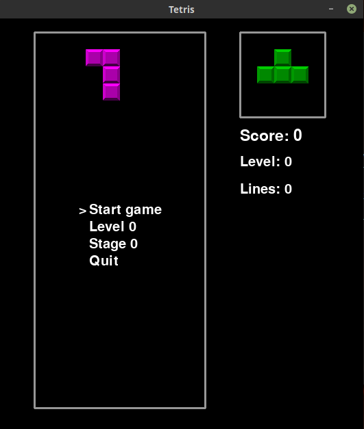
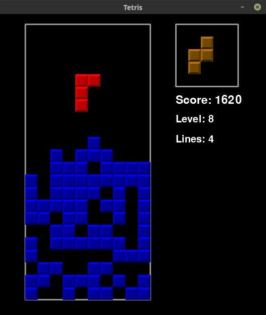

# Tetris
*Tetris game implemented in Python 3 and PyGame*

# Usage
Run:
```sh
$ python3 tetris.py
```

Controls:

* **Left Arrow**: move piece left.
* **Right Arrow**: move piece right.
* **Down Arrow**: move piece down (fast).
* **Up Arrow**: rotate piece clockwise.
* **Space**: rotate piece anti anticlockwise.
* **Intro**: pause.






